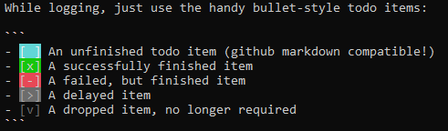

# Bashlog

A simple, directory-driven logging utility for CLI for quick notes, long journals, or bullet-style todo lists.

Works in bash with vim. But you can easily extend the idea to ther environments

# Setup

1. Get the repo: 

`git clone git@github.com:jodavaho/bashlog.git ~/.config/bashlog`

2. Add some magic to your `~/.bashrc`:

```
source ~/.config/bashlog/bashlog.sh
```

From anywhere on your machine, just type `log`, to be taken to a date-stamped file that contains whatever you need to record. 

# Easy intro

Need to keep track of something you just thought of? 

Just type `log<enter>` and you'll have a terminal with all of today's notes that were stored in the specified directory.

What did you write yesterday? `log yesterday<enter>`. Easy peasy.  Same for tomorrow, a month from now (`log 1 month`), last week `log last week` etc etc. Bashlog uses `date` and sometimes `dateutils`, so it gets a lot of flexibility. 

# Todo lists

While logging, just use the handy bullet-style todo items:

```
- [ ] An unfinished todo item (github markdown compatible!)
- [x] A successfully finished item
- [-] A failed, but finished item
- [>] A delayed item
- [v] A dropped item, no longer required
```

To spice it up a bit, I added the color-highlights in `vim_log`, and they are added by default when you type `log`.

(otherwise, Just add to your .bashrc: `export LOG_EDITOR=`vim -S vim_log`)

Or, just add it to .vimrc forever if you really like it.

```
cat vim_log >> ~/.vimrc
```

See image:



## Getting todo items on CLI

To see the todo items in your directory, use `lstodo`.

I usually do this:

`lstodo -nl | vim -` to get a jump-list for VIM. 

My daily morning ritual to prioritize is to scroll through list, using `gF` to jump to the todo item, mark it, and `b#` jump back. Vimrc settings to help with this are `set autowrite`

## Weekly

However, for most todos, I set weekly goals. For this, I use `week`.
This creates files like `2019-week-X` where `X` is the current week. Ticking off weekly goals leading up to the weekend is *quite* rewarding.

You can view last week with `week -1` or next week with `week +1`, or arbitrarily `week +/-X` to jump around. 


# Log tips

the `log` command uses `date` and `dateutils` to form the filename. SO you can do nifty things like:

- `log tomorrow`
- `log yesterday`
- `log last monday`
- `log 1 month`

etc

## Journaling

I like to write my daily thoughts (e.g., journal), using `log` and re-read yesterday / the before by using `log yesterday` and `log last wed` for example. 

I've been using this system for almost a decade. As of the time of this commit ...

```
:~/journal$ ls -l | wc -l
1461
:~/journal$ cat * | wc
  33948  298680 1642722
```

Reading journal entries from when my wife and I started dating is a real treat.
My health has been easy to track. I have a greppable archive of my hourly
thoughts in plain text. I've given real thought to applying some analytics to
this dataset, including sentiment analysis. Though I go on and off with the
habit of journalling, lowering the barrier of adding an entry has significantly
helped. 

## Different log directories.

Sometimes I change projects. e.g., when moving between python environments, catkin workspaces, etc. In the `setup.sh` or `activate.sh`, I like to add:

```
export LOG_DIRECTORY <the project workspace>/notes
```

This means that for each project, you will definitely have a consistent set of notes and todos, which will not overlap. 

## Base workspace

For things like journalling, I also `alias home='export LOG_DIRECTORY=~/journal'`

## Git integration

I don't recommend this for all logs, but to remove all possible workflow barriers, I have a convenience vim command so that I can keep my logs in github easily. 

`command Lw w | !git add % &&  git commit % -m "Checkin %" && git push`

If you set up a github repo to store your logs. Then the workflow becomes:

- from the command line: `log<enter>`
- record your notes
- `:Lw` to push this new entry to github
- `:wq` to exit, and you're back. 

This has the advantage of not requiring any directory changes, looing away from your screen, etc. 

# Configuring

By default, we use environment variables, which can be over-ridden as you see fit, by exporting the variable in `.bashrc` before `source bashlog.sh`

- `LOG_DIRECTORY`, Default: `~`
- `LOG_EDTIOR`, Default: `vim`; For best effect, the `bashlog.sh` will actually set `LOG_EDITOR` to `vim -S <this directory>/vim_log`, where `<this directory>` is, where you put this repo

You can always adjust these environment variables on the fly as you change working contexts or project workspaces, to keep a consistent pointer to the log directory. 

# Help

These scripts were yanked from my ever-growing dotfiles repo. If I messed something up, file an issue and let's chat. Also good for suggestions. 

